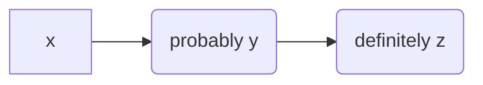

${meta({
	title: "First Page"
})}

# markdown!

If all you need is markdown, you can do that!

We can even do code blocks with syntax highlighting.

```js
const result = getResult();
```

Or mermaid diagrams:



Of course, you can also build [normal html pages](html.html).

And of course, you can also embed HTML with custom components directly in your
markdown. For example, here's a countdown component that makes a simple API request when it's done:

<div>
	<sample:countdown from=10></sample:countdown>
</div>

For a *slightly* more sophisticated example, check out the [todo sample](todo.html);
